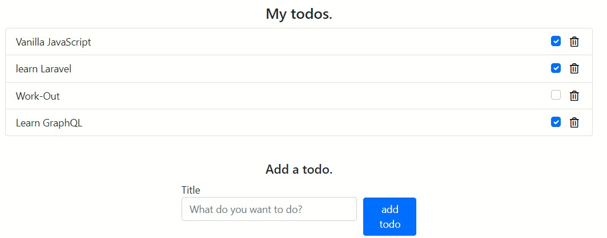

### Step by step guide to a simple RESTful API using PostgresSQL

#### Prerequisites

To follow along in this article, it is important to have the following:

- [Node.js](https://nodejs.org/en/) installed on your computer.

- [Postgresql](https://www.postgresql.org/download/) installed on your computer.

- [pgAdmin](https://www.pgadmin.org/download/) installed on your computer.

- Basic knowledge of JavaScript.

- Basic knowledge of [Express JS](https://expressjs.com/).

- Familiarity with writing simple SQL queries.

- Familiarity with [Postgresql](https://www.postgresql.org/).

### Overview

- [Introduction](#introduction)

- [Application overview](#application-overview)

- [Setting up the application](#setting-up-the-application)

- [Setting up the PostgreSQL database](#setting-up-the-postgresql-database)

- [Configuring the database in the application](#configuring-the-database-in-the-application)

- [Setting up the controllers](#setting-up-the-controllers)

- [Linking the controllers to the routes](#linking-the-controllers-to-the-routes)

- [Setting up the views](#setting-up-the-views)

- [Linking the views to the routes](#linking-the-views-to-the-routes)

- [Running the application](#running-the-application)

### Introduction

API stands for Application Programming Interface. It is a computing interface that defines the communication pattern between two software programs.

[REST](https://www.edureka.co/blog/what-is-rest-api/) stands for **RE**presentational **S**tate **T**ransfer. It is a set of design criteria on an API that uses HTTP mechanisms for accessing and using data. The HTTP mechanisms involve the HTTP verbs such as `GET`, `POST`, `PUT`, and `DELETE`.

An API that applies the `REST` style is referred to as `RESTful`.

A RESTful API involves a client sending a request to the server and the server responding to the request with a response. The following diagram depicts the concept:


[**_Image source_**](https://clevertechie.com/guides/96/what-is-rest-api-restful-web-services)

### Application overview

In this article, we will create a todo list application that utilizes a RESTful API to communicate with the server.

The application will implement all `CRUD` operations in the following ways:

- CREATE. Adding a todo.

- READ. Viewing all todos.

- UPDATE. Updating a done todo.

- DELETE. Deleting a todo.



The above `CRUD` operations correspond to the HTTP methods as shown:


[**_Image source_**](https://www.edureka.co/blog/what-is-rest-api/)

### Setting up the application

To set up the application, clone this [Github repository](https://github.com/mwangiKibui/postgresql-basic-crud-operations).

The repository has two folders, start, and final. Throughout the article, we will be working on the start folder but in case you want to verify anything, feel free to check out in the final folder.

After cloning the repository, open the project in your terminal and run the following:

```bash
npm install
```

to install the dependencies. The following are the dependencies we are going to use in the application:

- [cors](https://www.npmjs.com/package/cors). For providing cross-origin access between the client and the server.

- [ejs](https://www.npmjs.com/package/ejs). Templating engine for Node.js

- [express](https://www.npmjs.com/package/express). Node.js web framework.

- [pg](https://www.npmjs.com/package/pg). For connecting our Node.js app to PostgreSQL.

### Setting up the PostgreSQL database

In order to kickstart our project, we need to ensure that we have set up our database. To do so, from your pgAdmin:

- Create a database, `my_todos_db`.

```SQL
CREATE DATABASE my_todos_db
```

From above, we are simply creating a database `my_todos_db`.

- Create a table, `todos`.

```SQL
CREATE TABLE todos (
  id SERIAL PRIMARY KEY,
  title VARCHAR(100) NOT NULL,
  checked  Boolean NOT NULL)
```

From above, we are creating a table `todos` with columns, id, title, and checked.

### Configuring the database in the application.

To configure the database, proceed to the `src/config/db.js` file. Pass in your own details as follows:

```js
const Pool = require("pg").Pool;
const pool = new Pool({
  user: "postgres", // default postgres
  host: "localhost",
  database: "my_todos_db", // change if you used a different name
  password: "enter_your_password", //added during PostgreSQL and pgAdmin installation
  port: "5432", //default port.
});
```

From above, we are:

- Setting the configuration details of the database to connect.

In order to ensure that everything is okay, start the development server from your terminal by running:

```bash
npm run dev
```

In case there was an error connecting to the database, you will be prompted in the console. Ensure that you fix the error before proceeding to the next step.

### Setting up the controllers

After having configured our database, we can now store and access the data from there. In the `src/controllers/Todo.js` file, we will implement the functionalities as follows:

```js
const db = require("../config/db");

class Todo {
  //get all todos.
  async getTodos() {
    let results = await db.query(`SELECT * FROM todos`).catch(console.log);

    return results.rows;
  }

  //create a todo.
  async createTodo(todo) {
    await db
      .query("INSERT INTO todos (title, checked) VALUES ($1, $2)", [
        todo.title,
        false,
      ])
      .catch(console.log);

    return;
  }

  //update a todo.
  async updateTodo(todoId) {
    //get the previous todo.
    let original_todo = await db
      .query(`SELECT * FROM todos WHERE id=$1`, [parseInt(todoId)])
      .catch(console.log);

    let new_checked_value = !original_todo.rows[0].checked;

    //update the checked todo
    await db
      .query(`UPDATE todos SET checked=$1 WHERE id=$2`, [
        new_checked_value,
        parseInt(todoId),
      ])
      .catch(console.log);

    return;
  }

  //delete a todo.
  async deleteTodo(todoId) {
    await db
      .query(`DELETE FROM todos WHERE id=$1`, [parseInt(todoId)])
      .catch(console.log);

    return;
  }
}

module.exports = Todo;
```

From above, we are:

- For each function, writing a specific query message to the database and returning the relevant data.

### Linking the controllers to the routes

For the previous methods to work, they have to be connected to the routes from which the client can query. For this, we need to link the routes to the controllers.

In the `src/routes/todos.js` file, we link them as follows:

```javascript
//Get all todos.
router.get("/", async (req, res) => {
  let todos = await new Todo().getTodos();
});

//Create a todo.
router.post("/todo", async (req, res) => {
  let { title } = req.body;

  await new Todo().createTodo({ title }, res);
});

//Update a todo.
router.put("/todos/:todoId", async (req, res) => {
  let { todoId } = req.params;

  await new Todo().updateTodo(todoId, res);

  let todos = await new Todo().getTodos();
});

//Delete a todo.
router.delete("/todos/:todoId", async (req, res) => {
  let { todoId } = req.params;

  await new Todo().deleteTodo(todoId);

  let todos = await new Todo().getTodos();
});
```

From above, we are:

- Linking each route to its respective controller method.

### Setting up the views

The views constitute our client-side. It is where the users of the application will be interacting.

In order to set up the views, we will follow the following steps:

1. Set up our home page. Proceed to `src/views/pages/home.ejs` and add the following:

```html
<%- include('../partials/header.ejs') %>

<section class="home-page">
  <div class="container">
    <div class="row">
      <div class="col-12 col-md-12 col-sm-12">
        <div class="todo-content">
          <h4 class="todo-heading">My todos.</h4>

          <%- include('../partials/todos.ejs') %> <%-
          include('../partials/add-todo.ejs') %>
        </div>
      </div>
    </div>
  </div>
</section>

<%- include('../partials/footer.ejs') %>
```

From above, we are:

- Importing home page header.

- Setting the layout of the home page.

- Importing the `todos.ejs` file. It contains the fetched todos. Not yet set up.

- Importing the `add-todo.ejs` file. It contains the form to add a todo. Not yet set up.

- Importing the footer.

2. Setting up the `todos.ejs` file. This file will show all the fetched todos. To set it up, we add up the following functionality in `src/views/partials/todos.ejs`:

```html
<ul class="list-group">
  <% for(let i = 0; i < todos.length; i++) { %>

  <li class="list-group-item d-flex justify-content-between align-items-center">
    <%= todos[i].title %>

    <div class="list-group-item-actions">
      <div class="form-check">
        <input type="checkbox" class="form-check-input" onclick="updateTodo(<%=
        todos[i].id %>)" <%= todos[i].checked ? "checked" : "" %> />
      </div>

      <button
        class="delete-todo-form-btn"
        onclick="deleteTodo(<%= todos[i].id %>)"
      >
        <i class="far fa-trash-alt"></i>
      </button>
    </div>
  </li>

  <% } %>
</ul>
```

From above, we are:

- Mapping through each fetched todo. With it, we are showing the todo and then appending update and delete actions with it. Each action is connected to an `onClick` listener.

For the listeners to work, in the `src/public/js/main.js` we configure them to send the requests to the server:

```javascript
//updating a todo.
function updateTodo(todoId) {
  //contact server
  return $.ajax({
    method: "put",

    url: `/todos/${todoId}`,

    contentType: "application/json",

    cache: false,

    error: (error) => {
      console.error(error);
    },
  });
}

//deleting a todo.
function deleteTodo(todoId) {
  //contact server
  return $.ajax({
    method: "delete",

    url: `/todos/${todoId}`,

    contentType: "application/json",

    cache: false,

    success: () => {
      location.reload();
    },

    error: (error) => {
      console.error(error);
    },
  });
}
```

From above, we are:

- Using [AJAX](https://www.w3schools.com/js/js_ajax_intro.asp) to communicate with the server based on `PUT` and `DELETE` method. This is because HTML forms do not support these methods on the go.

3. Setting up the `add-todo.ejs` file. From here, users will interact with the form to add their todos.

To add up the functionality, in the `src/views/partials/add-todo.ejs`, we implement the following :

```html
<div class="add-todo">
  <h5 class="add-todo-heading">Add a todo.</h5>

  <form class="add-todo-form" method="POST" action="/todo">
    <div class="form-group form-title">
      <label for="title"> Title </label>

      <input
        id="title"
        type="text"
        class="form-control"
        name="title"
        placeholder="What do you want to do?"
      />
    </div>

    <div class="form-group form-submit">
      <button type="submit" class="btn btn-primary">add todo</button>
    </div>
  </form>
</div>
```

From above, we are:

- Implementing a form that sends a `POST` request to the server alongside the data entered by a user.

### Linking the views to the routes.

In order for the server to send data to the client, we have to configure the routes with the views.

For the linking, we need to make the following configuration to the `src/routes/todos.js` file:

```javascript
router.get("/", async (req, res) => {
  // ... the rest of the code.

  return res.render("home", {
    todos,
  });
});

//Create a todo.
router.post("/todo", async (req, res) => {
  // ... the rest of the function code.

  return res.redirect("/");
});

//Update a todo.
router.put("/todos/:todoId", async (req, res) => {
  // ... the rest of the function code.

  return res.render("home", {
    todos,
  });
});

//Delete a todo.
router.delete("/todos/:todoId", async (req, res) => {
  // ... the rest of the function code

  return res.render("home", {
    todos,
  });
});
```

From above, we are:

- Connecting each route with its respective client response.

### Running the application

Having configured the views to the routes, it's time we visualize our application. To do this, follow the following steps:

- Ensure that the development server is running. If it's not, start it by running the following command:

```bash
npm run dev
```

- From your browser, visit `http://localhost:4000`.

- Interact with the app.

### Conclusion

RESTful APIs provide independence of the client and the server. This is a big advantage, especially when you on a team or when you want to build applications that scale.

To get to know about RESTful APIs, read the following [post](https://restfulapi.net/).

Happy coding!!
